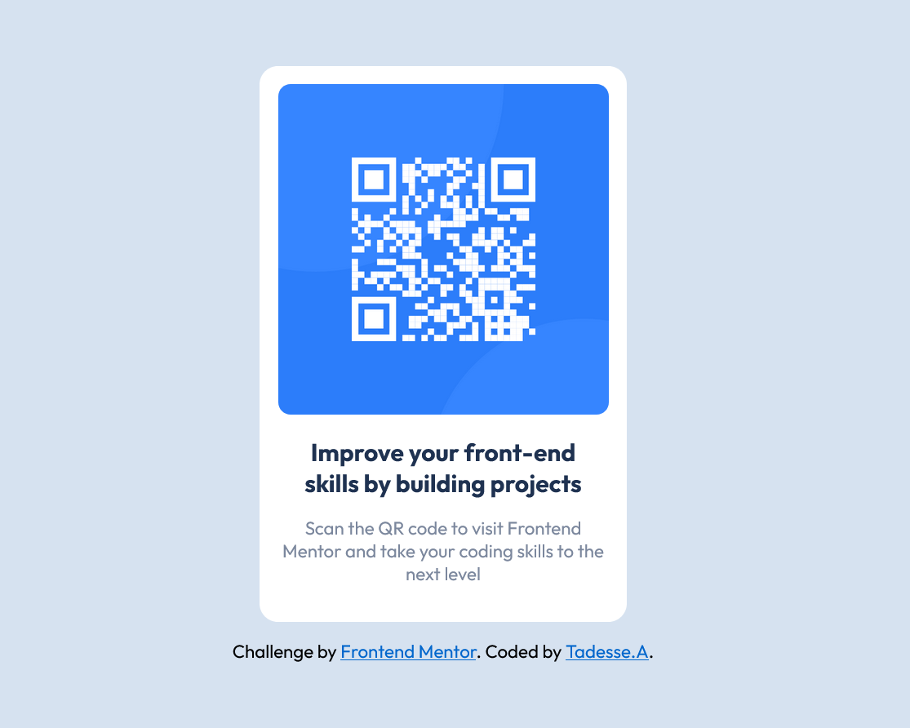

# Frontend Mentor - QR code component solution

This is a solution to the [QR code component challenge on Frontend Mentor](https://www.frontendmentor.io/challenges/qr-code-component-iux_sIO_H). Frontend Mentor challenges help you improve your coding skills by building realistic projects. 

### Screenshot

./screenshot.jpg

### Links

- Solution URL: [Github](https://github.com/Afroblman/QR-Code-Component?tab=readme-ov-file)
- Live Site URL: [Netlify](https://qr-code-component-fronend-mentor.netlify.app/)

### Built with

- Semantic HTML5 markup
- CSS custom properties
- Flexbox

## Author

- Frontend Mentor - [@Afroblman](https://www.frontendmentor.io/profile/Afroblman)

